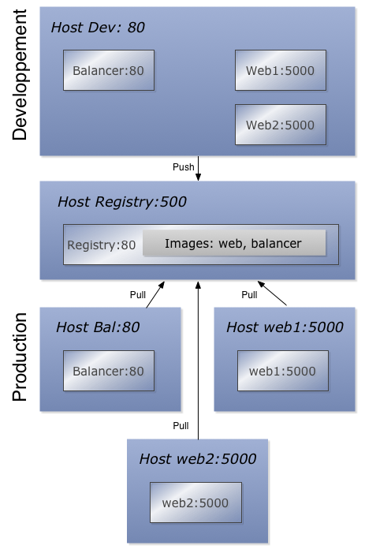

# Introduction à Docker

Le but de ce projet est de donner quelques points d'entrée à l'utilisation de Docker.

## Installation

### Debian

Pour cette distribution une "Jessie" est la manière la plus directe d'installer docker avec:

```
apt-get install docker.io
```

Note: il semble que les paquets ont disparus dans la version 8.1.

### MacOSX

Comme docker a besoin d'une installation Linux, docker sous Windows ou Macosx utilise VirtualBox comme __host__ principal. C'est le rôle de `docker-machine` de gérer la machine virtuelle linux. Elle est donc créée avec cet outil.

#### Avec Home Brew

	brew install docker-machine docker docker-compose

#### Avec un paquet officiel

Il faut suivre les indications depuis le site principal <http://docs.docker.com/mac/step_one/>.


## Concepts

### Host
Un host docker et une machine Linux (Virtuelle ou non) qui peut exécuter des __containers__ docker.

### Images
Une __image__ docker est la base d'un container. Elle est passive dans le sens qu'elle n'est pas exécutée. On peut récupérer une image existante sur le site docker hub <https://hub.docker.com/> avec la commande:

	docker pull <image_name>
	
Il est possible de créer ses propres images en écrivant un fichier __Dockerfile__. En général une image se termine par l'exécution d'une et une seule commande, par ex. `mysqld`.

### Container
C'est l'exécution d'une image. Il est exécuté dans l'équivalent d'un processus LXC (Linux Container). En général un et un seul processus tourne dans le container.

Toutes les données sont supprimées lors de l'arrêt d'un container; les données ne sont pas persistantes.

### Data volume
Comme les données d'un container ne sont pas persistantes, il existe la possibilité de créer des volumes de données qui peuvent être montés dans les containers. Les données sont stockées dans un répertoire du __docker host__.

Une méthode alternative consiste à monter un répertoire du __host__ comme __volume__ d'un __container__.


## En pratique

### Environnement
La commande `docker-machine` permet de gérer un set de __host docker__.

On peut créer un nouvel __host docker__ avec:

	docker-machine create -d virtualbox dev
	
Le host est prêt pour exécuter des containers, mais il faut mettre à jours les variables d'environnement:

	eval "$(docker-machine env dev)"

Note: il est possible de le mettre dans les fichiers d'init de bash (.profile, .bashr, etc.) si on développe avec la même machine.

### Mon premier container

Cette commande permet de récupérer une image du __docker hub__ et de l'exécuter en tant que container.

	docker run hello-world


Notez que le container s'arrête quand la commande se termine. Une deuxième exécution sera plus rapide car l'image __hello world__ sera stockée localement.


Pour voir la liste des images disponibles localement:

	docker images
	REPOSITORY          TAG                 IMAGE ID            CREATED             	VIRTUAL SIZE
	hello-world         latest              af340544ed62        2 weeks ago         	960 B

La commande listant les containers:

	docker ps


ne retourne rien. Il faut ajouter une option pour voir les containers terminés:


	docker ps -a


Mais alors comment se connecter à un container? Il faut lancer un `bash` sur une distribution connue comme par ex. une Debian:

	docker run -ti debian:jessie bash

Il est intéressant de voir que seul le process bash tourne en exécutant `ps`.

Dans un autre terminal on peut voir le container en cours d'exécution avec `docker ps`.

### Les images dans le HUB

On peut chercher les images disponibles avec `docker search python` par exemple. Les images officielles ne sont pas préfixées, par exemple pour python on a __python__, __google/python__, la première est officielle: vérifiée par le team docker, la deuxième, non. Il est possible spécifier une version en faisant suivre un ":" au nom de l'image, par ex. __python:2.7__. Il est recommander d'utiliser toujours la version pour s'assure qu'on travaille toujours avec la même version de l'image à travers le temps. Pour trouver les versions il faut passer par le __Docker HUB__ <https://hub.docker.com> (demande un compte).

## Créer sa première image avec un Dockerfile

Il est intéressant d'utiliser les images existantes, mais encore plus de les personnaliser.

Imaginons une application web très simple en __python-flask__ consistant en un fichier __myapp/myapp.py__:

	from flask import Flask
	app = Flask(__name__)

	@app.route('/')
	def hello_world():
		return 'Hello World!'

	if __name__ == '__main__':
		app.run()

Si le module Flask est installé avec `pip install Flask` et que l'on exécute le script `python myapp/myapp.py` la page web peut être consultée avec un navigateur.

Imaginons que je veux faire tourner cette application dans un container docker. Il faut d'abord choisir une image de base; dans ce cas une image python en version 2.7 par exemple: __python:2.7-slim__.

Les étapes consistent à:
1) avoir une image avec python 2.7
2) install Flask avec `pip install Flask`
3) copier le fichier dans le container
4) exécuter le script `python myapp/myapp.py`

Voici le __myapp/Dockerfile__ correspondant que nous mettrons dans le répertoire web:

	# step 1
	FROM python:2.7-slim

	# step 2
	RUN pip install Flask
	RUN mkdir /web

	# step 3
	COPY myapp.py /web/

	#step 4
	CMD python /web/myapp.py

Nous pouvons alors construire notre image que nous nommerons __myapp__.

	docker build -t myapp myapp
	
Pour exécuter le container que nous nommerons __myapp__ également:

	docker run --name myapp myapp

Le serveur tourne bien dans le container on peut le vérifier avec `docker ps`. Pour le stopper `docker stop myapp`.

Bien, nous avons donc notre premier container avec une application web, mais comment le voir dans un navigateur? Tout d'abord il faut savoir que les containers sont isolés du __host__. Donc le port n'est pas visible depuis celui-ci. On peut y remédier avec une option lors de l'exécution du container:

	docker rm myapp
	docker run -ti -p 80:5000 --name myapp myapp

On peut vérifier que tout fonctionne en se connectant sur le __host docker__ avec:
	
	docker-machine ssh dev
	
et en exécutant:
	
	wget http://localhost:80
	
Ok mais comment voir le site web dans un navigateur? Simplement en récupérant l'adresse IP du host `docker-machine ip`.

## Une application web plus avancée

Nous avons vu comment faire une application web python dans un docker. Mais le serveur utilisé est fait uniquement pour le développement. Nous allons maintenant servir notre application avec un serveur web écrit en __python__: `gunicorn`. Le serveur sera exécuté avec un utilisateur dédié et nous allons créer un espace de stockage permanent pour les logs. Cette nouvelle image sera appelée __web__.

### Etape 1: un nouveau web serveur exécuter avec un utilisateur non root

Voici le nouveau fichier __web/Dockerfile__:

	FROM python:2.7-slim

	# information sur le créateur
	MAINTAINER Johnny Mariéthoz <chezjohnny@gmail.com>

	# installation des paquets Debian nécessaire à gunicorn
	RUN apt-get update -y && apt-get install -y gcc

	# les variables d'environnement pour l'utilisateur
	ENV USER myuser
	ENV HOME /home/myuser

	# ajustement des paths pour pip --user
	ENV PATH /usr/local/sbin:/usr/local/bin:/usr/sbin:/usr/bin:/sbin:/bin:${HOME}/.local/bin

	# création de l'utilisateur
	RUN useradd --home-dir $HOME --create-home --shell /bin/bash --uid 1000 $USER
	
	# création du répertoire de travail
	RUN mkdir $HOME/www

	# changement du répertoire de travail
	WORKDIR ${HOME}/www

	# copier le fichier d'application
	COPY myapp.py  $HOME/www/

	# ajustement des permissions
	RUN chown $USER:$USER -R ${HOME}

	# changement d'utilisateur
	USER $USER

	# intallation des modules python
	RUN pip install --user gunicorn eventlet Flask

	# commande par defaut: exécution du serveur web
	CMD gunicorn --log-file=- --bind 0.0.0.0:5000   -w 3 --worker-connections=2000 --backlog=1000  -k eventlet myapp:app

On essaie:

	docker build -t web web
	docker rm web; docker run --name web -ti -p 80:5000 web

et on a bien notre "Hello" dans notre navigateur.

### Etape 2: garder les logs

Un container perd toutes les données lorsqu'il s'arrête. Pour résoudre cela il faut utiliser un container spécial: un __data volume__. On peut créer un volume dans tous les containers, mais le mieux est d'en avoir un dédié.

Ici le serveur est exécuté sous un utilisateur dédié et donc il n'aura pas les droits d'écriture sur le volume. Nous devons donc avoir une image particulière définie par le __data/Dockerfile__ suivant:
	
	# n'importe quelle image fait l'affaire, mais de préférence une qui est déjà en cache
	FROM python:2.7-slim

	ENV USER myuser
	# création de l'utilisateur avec un uid réutilisé dans les autres containers
	RUN useradd --shell /bin/bash --uid 1000 $USER

	# création et ajustement des droits du répertoire
	RUN mkdir -p /data && chown $USER:$USER -R /data

	# définition du volume
	VOLUME ["/data"]

La création du volume se fait comme ceci:
	
	docker build -t myapp_data data
	docker create --name myapp_data myapp_data

Il suffit de l'utiliser lors de l'exécution de notre web app:

	docker run --volumes-from=myapp_data --name web -ti -p 80:5000 web gunicorn --log-file=/data/myapp.log --bind 0.0.0.0:5000   -w 3 --worker-connections=2000 --backlog=1000  -k eventlet myapp:app

Nous avons surchargé ici la commande exécutée pour donner le chemin du fichier de log.

Comment contrôler que le fichier de log existe vraiment? Le volume est un espace de stockage sur le __host docker__, on peut le localiser comme ceci:

	docker inspect myapp_data|grep data

on quelque chose comme `/mnt/sda1/var/lib/docker/volumes/6f000628ca42c5e1eed77feee091c2af3def6e253b1612082b6274cb66384cc8/_data`. Il suffit de se connecter sur le host via ssh `docker-machine ssh dev` et de vérifier que le fichier de log existe dans le répertoire indiqué.

Il est à noter que les données persistent même si l'image __et__ le container __myapp_data__ sont supprimés.

## Gestion des containers multiples

Nous avons vu comment créer des containers simples et les faire interagir, mais cela demande passablement de commandes. Pour simplifier cette gestion il existe un outils: `docker-compose`.

Imaginons que nous avons deux fichiers `web/Dockerfile` et `data/Dockerfile` comme définis précédemment. Un pour l'application web et un pour le volume de données. Imaginons que nous voulons un "load balancer" devant plusieurs instance de note appli web. Nous allons créer un nouveau __Dockerfile__ pour le __load balancer__ basé sur ngix. Le tout va logger dans le même répertoire.

Voici le fichier __balancer/Dockerfile__ pour nginx:

	# une image existe déjà pour nginx
	FROM nginx

	# copie des config
	COPY nginx.conf /etc/nginx/nginx.conf
	COPY myapp_nginx.conf /etc/nginx/conf.d/myapp.conf

	# suppression de la conf par défaut
	RUN rm /etc/nginx/conf.d/default.conf

Dans le fichier __balancer/nginx.conf__ on va spécifier le fichier de log:

	user  nginx;
	worker_processes  1;

	# modification
	error_log  /data/nginx_error.log warn;
	pid        /var/run/nginx.pid;


	events {
   		worker_connections  1024;
	}


	http {
   		include       /etc/nginx/mime.types;
    	default_type  application/octet-stream;

    	log_format  main  '$remote_addr - $remote_user [$time_local] "$request" '
                      '$status $body_bytes_sent "$http_referer" '
                      '"$http_user_agent" "$http_x_forwarded_for"';
		# modification
    	access_log  /data/nginx_access.log  main;

    	sendfile        on;
    	#tcp_nopush     on;

    	keepalive_timeout  65;

    	#gzip  on;

    	include /etc/nginx/conf.d/*.conf;
	}

La configuration du __load balancer__ se fait comme ceci:

	upstream web {
		server web_1:8000;
		server web_2:8000;
	}
	server {
        listen 80;
        server_name "localhost";

        access_log /data/nginx_myapp.net_access.log combined;
        error_log  /data/nginx_myapp.net_error.log;

        location /myapp {
                proxy_pass http://web;
                proxy_set_header X-Real-IP $remote_addr;
                proxy_set_header X-Forwarded-For $proxy_add_x_forwarded_for;
                proxy_set_header Host $http_host;
                proxy_set_header X-Scheme $scheme;
                proxy_set_header SCRIPT_NAME /myapp;
        }
	}

Nous pouvons voir que nous allons avoir deux containers de l'image web: web_1 et web_2, mais comment nginx peut connaître les containers web? Grâce à l'option __link__.

Voici le fichier__docker-compose.yml__:

	# web server
	web:
   		# répertoire pour construire l'image
   		build: web
   		# données persistantes pour les logs
    	volumes_from:
       	- myapp_data
    	# port exposé pour les autres containers
    	expose:
       	- "5000"
    	# surcharge de la commande pour spécifier les logs
    	command: gunicorn --log-file=/data/myapp.log --bind 0.0.0.0:5000   -w 3 --worker-connections=2000 --backlog=1000  -k eventlet myapp:app

	# load balancer
	balancer:
   		build: balancer
    	# le port 80 du container est redirigé sur le port 80 du host docker
    	ports:
       	- "80:80"
    	# utilise le(s) cotainer(s) web
    	links:
       	- web
    	# données persistantes pour les logs
    	volumes_from:
       	- myapp_data

	# données persistantes pour les logs
	myapp_data:
  	# utilisation d'une image existante contenant l'historique des logs
  	image: myapp_data
  	volumes:
   		- "/data"
   		
Maintenant il reste à construire les images:

	docker-compose build
	
on crée deux instances de _web__:
	
	docker-compose scale web=2

et on exécute le service au complet:

	docker-compose up

Le site web est dispo et est bien balancé.

## Docker en production (Proof of concept)

Voici un workflow à tester avec docker:



Nous allons créer différents hosts docker:

- un pour le développement. __devel__
- une registry privée: __registry__
- un pour le load balancer: __balancer__
- deux pour notre application web: __web1__ __web2__

### Notes

#### Partage de fichiers
Nous allons simuler le système de fichier partagés avec une particularité de __docker-machine__ sous MacOSX. Le dossier __/Users__ est monté directement dans le host virtualbox lors de la création de celle-ci. Nous allons donc monter directement un sous-répertoire de __/Users__ dans les containers pour les __logs__ et pour le fichier de config __nginx__ (voir les fichiers __docker-compose.yml__ correspondants).

#### Une image au lieu d'un build
Sur la production nous ne voulons pas construire l'image mais utilise une image déjà disponible, dans ce cas la directive __build__ du fichier __docker-compose.yml__ est remplacé par __image__ (voir les fichiers __docker-compose.yml__ dans __prod_poc/web__ et __prod_poc/balancer__).

Chaque host correspond à une machine virtuelle. Voici la création des ces machines avec `docker-machine`:

	docker-machine create -d virtualbox registry
	docker-machine create -d virtualbox --engine-insecure-registry=`docker-machine ip registry`:5000 dev
	docker-machine create -d virtualbox --engine-insecure-registry=`docker-machine ip registry`:5000 balancer
	docker-machine create -d virtualbox --engine-insecure-registry=`docker-machine ip registry`:5000 web1
	docker-machine create -d virtualbox --engine-insecure-registry=`docker-machine ip registry`:5000 web2

On va démarrer le container de registry:

	eval "$(docker-machine env registry)"
	docker run -d -p 5000:5000 --name registry registry:2

Le code se trouve dans le répertoire __prod_poc__:

	cd prod_poc

On teste l'application en développement avec deux instances de __web__:

	eval "$(docker-machine env dev)"
	docker-compose build
	docker-compose scale web=2
	docke-compose up

L'application est disponible dans le navigateur à l'adresse `docker-machine ip dev`.

L'idée est d'utiliser la __registry__ comme un équivalent de notre __gitlab__ local.

On a besoin de __tagger__ nos images avec l'adresse de la __registry__:

	docker tag prodpoc_balancer `docker-machine ip registry`:5000/balancer
	docker tag prodpoc_web `docker-machine ip registry`:5000/web

Il reste à les pousser dans la __registry__:

	docker push `docker-machine ip registry`:5000/balancer
	docker push `docker-machine ip registry`:5000/web
	
Les images sont prêtes pour la prod! On récupère les images sur les machines de production:

	eval "$(docker-machine env web1)"
	docker pull `docker-machine ip registry`:5000/web
	docker tag `docker-machine ip registry`:5000/web web

	eval "$(docker-machine env web2)"
	docker pull `docker-machine ip registry`:5000/web
	docker tag `docker-machine ip registry`:5000/web web

	eval "$(docker-machine env balancer)"
	docker pull `docker-machine ip registry`:5000/balancer
	docker tag `docker-machine ip registry`:5000/balancer balancer

Les images sont disponibles dans les machines de production, cool.

Il faut maintenant démarrer les services __web__:

	cd web
	eval "$(docker-machine env web1)"
	docker-compose up -d
	
	eval "$(docker-machine env web2)"
	docker-compose up -d

Sur chaque machine le serveur répond sur `docker-machine ip web1` et `docker-machine ip web2`.

On récupère les adresses ip de __web1__ et __web2__ et on les mets dans le fichier de config __prod_poc/balancer/conf.d/myapp_nginx.conf__.

On peut maintenant démarrer le lancer:

	cd balancer 
	eval "$(docker-machine env balancer)"
	docker-compose up -d

Il est possible de modifier le fichier de configuration de __nginx__: __prod_poc/balancer/conf.d/myapp_nginx.conf__ et de forcer son chargement par le container:

	eval "$(docker-machine env balancer)"
	docker kill -s HUP balancer_balancer_1 


## Misc

### Rajouter une machine debian stock à `docker-machine`

On peut créer une debian minimale dans `VirtualBox` par exemple. J'ai rajouté un utilisateur `rero`. Lors de la création de la machine virtuelle j'ai rajouté un 2ème host réseau avec les options `Host Only` et l'interface `vboxnet1`.

Après le démarrage de la `Debian`, j'ai rajouté l'utilisateur avec les privilèges `sudo` sans mot de passe (temporairement):

    root@debian> echo "jojo ALL=(ALL:ALL) NOPASSWD:ALL" > /etc/sudoers.d/rero
    root@debian> chmod 0660 /etc/sudoers.d/rero

Il faut maintenant pouvoir se connecter depuis le host sans mot de passe sur la machine `debian`. On rajoute la clé `ssh` dans `/home/rero/.ssh/authorized_keys` (ne pas oublié de réduire les droits de lecture de ce fichier).

Sur le host on peut donc déclarer la machine docker par exemple:

    user@host>docker-machine -D create --generic-ip-address 192.168.99.101 --generic-ssh-user=rero -d generic --generic-ssh-key=$HOME/.ssh/id_rsa debian

Cette commande installe les outils docker sur la machine `debian`. Malgré que cela se termine par une erreur la machie est dispo sous `docker-machine`.

Note: il est possible de supprimer les privilèges sudo de `rero`.
Note: j'ai fais la même chose sur une machine avec `docker` installé avec:

	curl -sSL https://get.docker.com/ | sh

Cela marche aussi bien que j'ai la même erreur en fin de process. D'après un bug report trouvé sur le web, cette erreur sera résolue avec la version 0.5.

### Permettre à une machine distante de lancer des containers

Imaginons une machine __docker client__ de développement ayant les outils
`docker` installés. Il existe une autre machine dédiée __docker host__ à
exécuter des containers: une `debian` avec les outils `docker` installés avec:

    curl -sSL https://get.docker.com/ | sh

#### Pour une approche non sécurisée

Editer le fichier `/etc/systemd/system/multi-user.target.wants/docker.service` et changer la ligne correspondante avec:

	ExecStart=/usr/bin/docker daemon -H tcp://0.0.0.0:2375

Il faut relancer le service avec:

	systemctl stop docker
	systemctl daemon-reload
	systemctl start docker

Sur le client il faut utiliser les variables suivantes:

	unset DOCKER_CERT_PATH
	unset DOCKER_TLS_VERIFY
	export DOCKER_HOST="tcp://<__docker host__ ip address>:2375"
	export DOCKER_MACHINE_NAME="__docker host__"

Une fois toutes les confugurations faites il est possible d'exécuter les commandes `docker` depuis le __docker client__.

Note: la documentation pour sécuriser le deamon est ici:
<https://docs.docker.com/articles/https/>, sinon une autre approche consiste à
passer par une registry et se logger sur la machine __docker host__ pour lancer
les containers.

## Références

- Site principal docker: <https://www.docker.com/>
